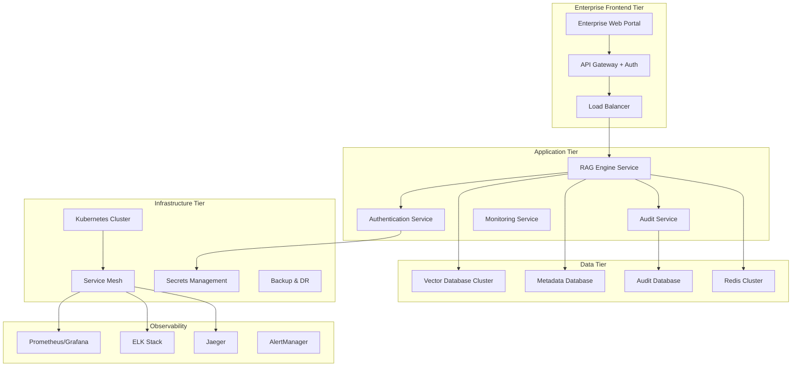

# RAG Engine Enterprise Roadmap
**Transforming Experimental Framework to Production-Grade Enterprise Solution**

---

## 🎯 **Executive Summary**

This roadmap outlines the systematic transformation of the RAG Engine from an experimental framework into a production-grade, enterprise-ready solution suitable for mission-critical applications. The plan addresses security, scalability, reliability, monitoring, compliance, and operational excellence requirements.

**Current State**: Experimental framework with solid core RAG pipeline but incomplete enterprise features  
**Target State**: Production-grade enterprise solution with 99.9% uptime, enterprise security, and full operational support  
**Timeline**: 18-24 months across 6 major phases  
**Investment**: Estimated 8-12 FTE engineering resources  

---

## 📊 **Current State Assessment**

### ✅ **Strengths (Foundation to Build On)**
- **Solid Core Architecture**: Modular RAG pipeline with 39/39 core tests passing
- **Excellent CLI Design**: AI-powered setup and management tools
- **Modern Frontend**: Vue.js application with good UX patterns
- **Local LLM Integration**: Working Ollama integration for on-premise deployments
- **Configuration System**: Flexible JSON/YAML configuration with validation
- **Plugin Architecture**: Extensible component system ready for enterprise plugins

### ❌ **Critical Enterprise Gaps**
- **94+ Failing Tests**: Enterprise features are broken stubs
- **No Security Framework**: Authentication, authorization, encryption missing
- **No Monitoring/Observability**: Metrics, logging, alerting incomplete
- **No Reliability Features**: Circuit breakers, retry logic, failover non-functional
- **No Compliance Framework**: Audit trails, data governance, regulatory compliance missing
- **No Multi-tenancy**: Single-tenant architecture unsuitable for enterprise SaaS
- **No Performance Optimization**: No caching, connection pooling, or optimization
- **No Deployment Automation**: No CI/CD, infrastructure as code, or automated deployments

---

## 🏗️ **Enterprise Architecture Vision**

### **Target Architecture Components**

---

## 📅 **6-Phase Implementation Plan**

## **Phase 1: Foundation & Security (Months 1-3)**
*Goal: Establish enterprise security foundation and fix failing tests*

### **1.1 Security Framework Implementation**
- **Authentication & Authorization**
  - OAuth 2.0/OIDC integration (Auth0, Okta, Azure AD)
  - RBAC with fine-grained permissions
  - API key management with rotation
  - JWT token handling with refresh tokens
  - MFA support for admin operations

- **Data Security**
  - Encryption at rest (AES-256) for all databases
  - Encryption in transit (TLS 1.3) for all communications
  - Field-level encryption for PII/sensitive data
  - Key management integration (HashiCorp Vault, AWS KMS)
  - Data masking for non-production environments

- **Input Security**
  - SQL injection prevention
  - XSS protection and content sanitization
  - Rate limiting and DDoS protection
  - Input validation and schema enforcement
  - Prompt injection attack prevention

### **1.2 Test Suite Remediation**
- **Fix 94 Failing Tests**
  - Conversational routing test fixes (MockLLM signature issues)
  - API integration test fixes (dependency injection)
  - Enhanced prompting test fixes (template loading)
  - Security module test implementation
  - Monitoring module test implementation

- **Test Infrastructure Enhancement**
  - Automated test execution in CI/CD
  - Test data management and fixtures
  - Performance test baseline establishment
  - Security test automation (SAST/DAST)
  - Test coverage reporting (target: 90%+)

### **1.3 Core Reliability Implementation**
- **Circuit Breaker Pattern**
  - Implement functional circuit breakers for LLM calls
  - Database connection circuit breakers
  - External API circuit breakers
  - Configurable failure thresholds and timeouts

- **Retry Logic**
  - Exponential backoff for transient failures
  - Jitter to prevent thundering herd
  - Configurable retry policies per component
  - Dead letter queues for failed operations

### **Deliverables**
- ✅ 100% test pass rate (0 failing tests)
- ✅ Complete authentication/authorization system
- ✅ Data encryption at rest and in transit
- ✅ Functional circuit breakers and retry logic
- ✅ Security test suite with automated scanning
- ✅ Compliance documentation (SOC 2 Type I preparation)

---

## **Phase 2: Observability & Operations (Months 4-6)**
*Goal: Implement comprehensive monitoring, logging, and operational excellence*

### **2.1 Monitoring & Metrics**
- **Application Performance Monitoring**
  - Prometheus metrics collection
  - Grafana dashboards for business and technical metrics
  - Custom metrics for RAG pipeline performance
  - SLA/SLO monitoring and alerting
  - Performance baseline establishment

- **Infrastructure Monitoring**
  - Kubernetes cluster monitoring
  - Database performance monitoring
  - Vector database query performance
  - Resource utilization tracking
  - Capacity planning metrics

### **2.2 Logging & Audit**
- **Centralized Logging**
  - ELK Stack (Elasticsearch, Logstash, Kibana) implementation
  - Structured logging with correlation IDs
  - Log aggregation from all services
  - Log retention policies and archival
  - Real-time log analysis and alerting

- **Audit Trail System**
  - Complete user action audit logging
  - Data access audit trails
  - Configuration change tracking
  - Compliance reporting capabilities
  - Immutable audit log storage

### **2.3 Distributed Tracing**
- **OpenTelemetry Integration**
  - End-to-end request tracing
  - Jaeger for trace visualization
  - Performance bottleneck identification
  - Service dependency mapping
  - Error correlation across services

### **2.4 Alerting & Incident Response**
- **AlertManager Configuration**
  - SLA breach alerting
  - Error rate threshold alerting
  - Infrastructure health alerting
  - Security incident alerting
  - Escalation policies and on-call rotation

### **Deliverables**
- ✅ Complete observability stack (metrics, logs, traces)
- ✅ Real-time dashboards for operations and business
- ✅ Automated alerting with escalation procedures
- ✅ Audit trail system meeting compliance requirements
- ✅ Incident response procedures and runbooks
- ✅ Performance baseline and SLA definition

---

## **Phase 3: Scalability & Performance (Months 7-9)**
*Goal: Optimize for enterprise-scale workloads and high availability*

### **3.1 Horizontal Scaling**
- **Microservices Architecture**
  - Service decomposition and API design
  - Independent service scaling
  - Service mesh implementation (Istio)
  - Load balancing and service discovery
  - Inter-service communication patterns

- **Database Scaling**
  - Vector database clustering (Pinecone, Weaviate, or Qdrant clusters)
  - Read replicas for metadata databases
  - Database sharding strategies
  - Connection pooling and management
  - Database performance optimization

### **3.2 Caching Strategy**
- **Multi-Level Caching**
  - Redis cluster for session and query caching
  - Application-level caching for embeddings
  - CDN integration for static assets
  - Database query result caching
  - Cache invalidation strategies

### **3.3 Performance Optimization**
- **Query Optimization**
  - Vector search optimization
  - Embedding batch processing
  - Parallel document processing
  - LLM request batching and optimization
  - Database query optimization

- **Resource Management**
  - Memory optimization and garbage collection tuning
  - CPU optimization for embedding generation
  - GPU utilization for local models
  - Storage optimization for vector indices
  - Network optimization for distributed components

### **3.4 High Availability**
- **Multi-Region Deployment**
  - Active-passive failover setup
  - Data replication across regions
  - Disaster recovery procedures
  - RTO/RPO target achievement
  - Automated failover testing

### **Deliverables**
- ✅ Auto-scaling microservices architecture
- ✅ High-performance caching layer
- ✅ Optimized query performance (sub-second response times)
- ✅ 99.9% uptime achievement
- ✅ Multi-region disaster recovery capability
- ✅ Performance testing and benchmarking suite

---

## **Phase 4: Enterprise Features & Multi-tenancy (Months 10-12)**
*Goal: Implement enterprise-specific features and multi-tenant architecture*

### **4.1 Multi-Tenancy**
- **Tenant Isolation**
  - Database-level tenant isolation
  - Vector database namespace isolation
  - Compute resource isolation
  - Configuration isolation per tenant
  - Cross-tenant data leakage prevention

- **Tenant Management**
  - Tenant onboarding automation
  - Resource quota management per tenant
  - Billing and usage tracking
  - Tenant-specific customizations
  - White-label capabilities

### **4.2 Advanced RAG Features**
- **Enterprise RAG Capabilities**
  - Multi-modal document processing (PDF, Word, PowerPoint, images)
  - Advanced chunking strategies (semantic, hierarchical)
  - Knowledge graph integration
  - Federated search across multiple knowledge bases
  - Real-time document synchronization

- **AI Model Management**
  - Model versioning and A/B testing
  - Custom model fine-tuning pipelines
  - Model performance monitoring
  - Cost optimization for LLM usage
  - Support for multiple LLM providers simultaneously

### **4.3 Enterprise Integrations**
- **Identity Provider Integration**
  - Active Directory integration
  - SAML 2.0 support
  - LDAP integration
  - Single Sign-On (SSO) capabilities
  - Just-in-time (JIT) user provisioning

- **Enterprise Systems Integration**
  - SharePoint integration
  - Confluence integration
  - Salesforce knowledge base integration
  - ServiceNow integration
  - Custom API connectors

### **4.4 Data Governance**
- **Data Classification**
  - Automated data classification
  - PII detection and handling
  - Data retention policies
  - Data lineage tracking
  - Right to be forgotten implementation

### **Deliverables**
- ✅ Fully isolated multi-tenant architecture
- ✅ Advanced RAG capabilities with multi-modal support
- ✅ Enterprise system integrations
- ✅ Comprehensive data governance framework
- ✅ White-label deployment capabilities
- ✅ Automated tenant onboarding

---

## **Phase 5: Compliance & Governance (Months 13-15)**
*Goal: Achieve enterprise compliance certifications and governance standards*

### **5.1 Compliance Frameworks**
- **SOC 2 Type II Certification**
  - Security controls implementation
  - Availability controls
  - Processing integrity controls
  - Confidentiality controls
  - Privacy controls

- **ISO 27001 Compliance**
  - Information security management system
  - Risk assessment and management
  - Security incident management
  - Business continuity planning
  - Vendor risk management

- **GDPR Compliance**
  - Data protection by design
  - Privacy impact assessments
  - Data subject rights implementation
  - Cross-border data transfer controls
  - Breach notification procedures

### **5.2 Industry-Specific Compliance**
- **HIPAA (Healthcare)**
  - Protected health information (PHI) handling
  - Business associate agreements
  - Access controls and audit logs
  - Encryption requirements
  - Risk assessments

- **Financial Services (PCI DSS, SOX)**
  - Payment card data protection
  - Financial reporting controls
  - Change management procedures
  - Segregation of duties
  - Data retention requirements

### **5.3 Data Governance Platform**
- **Data Catalog**
  - Automated data discovery
  - Data quality monitoring
  - Metadata management
  - Data lineage visualization
  - Impact analysis for changes

- **Privacy Management**
  - Consent management
  - Data subject request handling
  - Privacy policy enforcement
  - Data minimization controls
  - Purpose limitation enforcement

### **Deliverables**
- ✅ SOC 2 Type II certification
- ✅ ISO 27001 compliance
- ✅ GDPR compliance framework
- ✅ Industry-specific compliance (HIPAA, PCI DSS)
- ✅ Comprehensive data governance platform
- ✅ Automated compliance monitoring and reporting

---

## **Phase 6: Advanced AI & Innovation (Months 16-18)**
*Goal: Implement cutting-edge AI capabilities and innovation features*

### **6.1 Advanced AI Capabilities**
- **Agentic RAG**
  - Multi-agent coordination
  - Tool-using agents
  - Planning and reasoning agents
  - Agent workflow orchestration
  - Human-in-the-loop agent systems

- **Multimodal AI**
  - Vision-language models
  - Audio processing capabilities
  - Video content understanding
  - Cross-modal retrieval
  - Multimodal embedding spaces

### **6.2 Knowledge Management**
- **Dynamic Knowledge Graphs**
  - Real-time knowledge graph updates
  - Entity relationship learning
  - Knowledge graph reasoning
  - Temporal knowledge representation
  - Knowledge graph visualization

- **Continuous Learning**
  - Online learning from user interactions
  - Feedback-driven model improvement
  - Active learning for data annotation
  - Model drift detection and correction
  - Reinforcement learning from human feedback (RLHF)

### **6.3 Advanced Analytics**
- **Business Intelligence**
  - Usage analytics and insights
  - Content effectiveness analysis
  - User behavior analytics
  - ROI measurement and reporting
  - Predictive analytics for content needs

- **AI Explainability**
  - Model decision explanations
  - Bias detection and mitigation
  - Fairness monitoring
  - Transparency reporting
  - Interpretable AI dashboards

### **6.4 Innovation Platform**
- **Low-Code/No-Code Interface**
  - Visual pipeline builder
  - Drag-and-drop component configuration
  - Template marketplace
  - Custom component development
  - Workflow automation

### **Deliverables**
- ✅ Agentic RAG with multi-agent capabilities
- ✅ Multimodal AI processing
- ✅ Dynamic knowledge graph system
- ✅ Continuous learning platform
- ✅ Advanced analytics and BI dashboard
- ✅ Low-code/no-code platform for business users

---

## 🎯 **Success Metrics & KPIs**

### **Technical Metrics**
- **Reliability**: 99.9% uptime SLA achievement
- **Performance**: <500ms average query response time
- **Scalability**: Support for 10,000+ concurrent users
- **Security**: Zero critical security vulnerabilities
- **Test Coverage**: 95%+ code coverage
- **Deployment**: <5 minute deployment time

### **Business Metrics**
- **Customer Satisfaction**: >4.5/5 rating
- **Enterprise Adoption**: 100+ enterprise customers
- **Revenue Impact**: $10M+ ARR from enterprise features
- **Compliance**: 100% audit pass rate
- **Support**: <4 hour response time for critical issues
- **Onboarding**: <1 day customer onboarding time

### **Operational Metrics**
- **Incident Response**: <15 minute MTTR for critical issues
- **Change Failure Rate**: <5% for production deployments
- **Security Incidents**: Zero data breaches
- **Compliance**: 100% regulatory requirement compliance
- **Documentation**: 100% feature documentation coverage
- **Training**: 100% team certification on enterprise features

---

## 💰 **Investment & Resource Requirements**

### **Engineering Team Structure**
- **Platform Engineering**: 2-3 FTE (Infrastructure, DevOps, Security)
- **Backend Engineering**: 3-4 FTE (Core services, APIs, integrations)
- **Frontend Engineering**: 1-2 FTE (Enterprise UI, dashboards)
- **AI/ML Engineering**: 2-3 FTE (Advanced AI features, model optimization)
- **QA/Test Engineering**: 1-2 FTE (Test automation, quality assurance)
- **DevSecOps Engineering**: 1-2 FTE (Security, compliance, operations)

### **Technology Investment**
- **Cloud Infrastructure**: $50K-100K/year (AWS/Azure/GCP)
- **Security Tools**: $25K-50K/year (Vault, security scanning tools)
- **Monitoring Stack**: $15K-30K/year (Prometheus, Grafana, ELK)
- **Compliance Tools**: $20K-40K/year (Compliance management platforms)
- **Development Tools**: $10K-20K/year (CI/CD, testing tools)
- **Third-party Services**: $30K-60K/year (Auth providers, AI services)

### **Professional Services**
- **Security Audit**: $50K-100K (SOC 2, penetration testing)
- **Compliance Consulting**: $100K-200K (SOC 2, ISO 27001, GDPR)
- **Architecture Review**: $25K-50K (Enterprise architecture validation)
- **Performance Testing**: $25K-50K (Load testing, optimization)

**Total Estimated Investment**: $2M-4M over 18 months

---

## 🚀 **Implementation Strategy**

### **Agile Methodology**
- **2-week sprints** with regular stakeholder reviews
- **Continuous integration/deployment** for rapid iteration
- **Feature flags** for safe production rollouts
- **A/B testing** for enterprise feature validation
- **Regular retrospectives** for process improvement

### **Risk Mitigation**
- **Parallel development** of critical path items
- **Proof of concepts** for high-risk technical decisions
- **Third-party vendor evaluation** and backup options
- **Regular security assessments** throughout development
- **Compliance checkpoints** at each phase milestone

### **Quality Assurance**
- **Test-driven development** for all new features
- **Automated security scanning** in CI/CD pipeline
- **Performance regression testing** for each release
- **Compliance validation** at each phase gate
- **Customer feedback integration** throughout development

---

## 📋 **Phase Gate Criteria**

### **Phase 1 Gate Criteria**
- [ ] 100% test pass rate (0 failing tests)
- [ ] Authentication/authorization system operational
- [ ] Data encryption implemented and validated
- [ ] Security audit passed with no critical findings
- [ ] Circuit breakers and retry logic functional

### **Phase 2 Gate Criteria**
- [ ] Monitoring stack operational with 24/7 coverage
- [ ] Audit trail system meeting compliance requirements
- [ ] Incident response procedures tested and validated
- [ ] Performance baseline established and documented
- [ ] SLA/SLO definitions agreed with stakeholders

### **Phase 3 Gate Criteria**
- [ ] 99.9% uptime achieved in production
- [ ] Auto-scaling validated under load
- [ ] Sub-second query response times achieved
- [ ] Disaster recovery procedures tested
- [ ] Performance benchmarks meeting enterprise requirements

### **Phase 4 Gate Criteria**
- [ ] Multi-tenant architecture operational
- [ ] Enterprise integrations functional
- [ ] Data governance framework implemented
- [ ] White-label capabilities validated
- [ ] Tenant onboarding automated

### **Phase 5 Gate Criteria**
- [ ] SOC 2 Type II certification achieved
- [ ] GDPR compliance validated
- [ ] Industry-specific compliance implemented
- [ ] Compliance monitoring automated
- [ ] Audit procedures documented and tested

### **Phase 6 Gate Criteria**
- [ ] Advanced AI capabilities operational
- [ ] Knowledge graph system functional
- [ ] Analytics platform delivering insights
- [ ] Low-code platform validated with users
- [ ] Innovation roadmap defined for next phase

---

## 🔄 **Continuous Improvement**

### **Post-Launch Operations**
- **Quarterly business reviews** with enterprise customers
- **Monthly security assessments** and vulnerability management
- **Continuous performance optimization** based on usage patterns
- **Regular compliance audits** and certification renewals
- **Innovation pipeline** for next-generation features

### **Customer Success**
- **Dedicated customer success team** for enterprise accounts
- **Regular training and certification programs** for customer teams
- **24/7 enterprise support** with guaranteed SLA
- **Quarterly business reviews** and optimization recommendations
- **Innovation workshops** for advanced use cases

### **Technology Evolution**
- **Regular technology stack evaluation** and modernization
- **AI model updates** and performance improvements
- **Security framework evolution** with threat landscape
- **Compliance framework updates** with regulatory changes
- **Architecture evolution** for emerging enterprise needs

---

## 📞 **Next Steps**

### **Immediate Actions (Next 30 Days)**
1. **Stakeholder Alignment**: Present roadmap to executive team and secure budget approval
2. **Team Assembly**: Begin recruiting for key engineering positions
3. **Vendor Evaluation**: Start evaluation of critical third-party services
4. **Architecture Review**: Conduct detailed technical architecture review
5. **Compliance Planning**: Engage compliance consultants for certification planning

### **Phase 1 Kickoff (Next 60 Days)**
1. **Development Environment Setup**: Establish enterprise development infrastructure
2. **Security Framework Design**: Begin detailed security architecture design
3. **Test Strategy**: Develop comprehensive test remediation strategy
4. **CI/CD Pipeline**: Implement enterprise-grade CI/CD pipeline
5. **Monitoring Foundation**: Begin observability stack implementation

### **Success Criteria Definition (Next 90 Days)**
1. **SLA/SLO Definition**: Define enterprise-grade service level agreements
2. **Compliance Requirements**: Finalize compliance framework requirements
3. **Performance Benchmarks**: Establish enterprise performance benchmarks
4. **Security Standards**: Define enterprise security standards and controls
5. **Quality Gates**: Establish quality gates for each development phase

---

**This roadmap transforms the RAG Engine from an experimental framework into a production-grade enterprise solution suitable for mission-critical applications. The phased approach ensures systematic progress while managing risk and maintaining quality throughout the transformation.** 