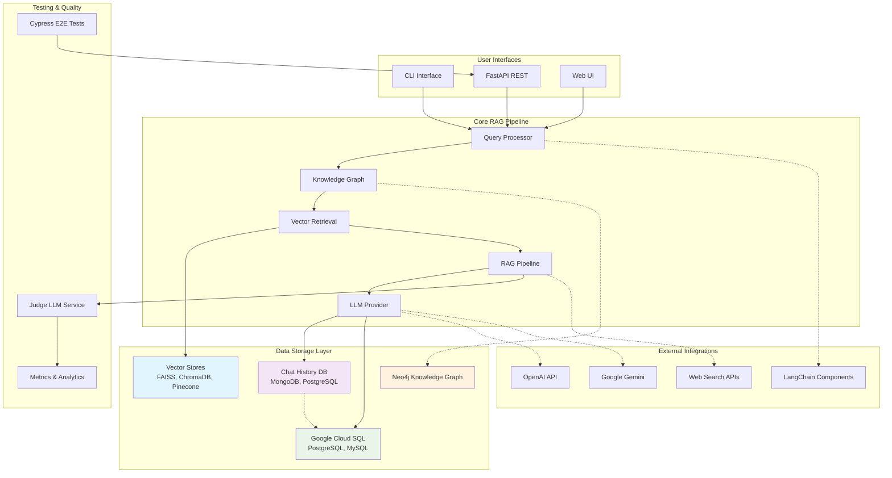

# RAG Engine — Modular Retrieval-Augmented Generation Framework

## 🚀 Vision

**RAG Engine** is a plug-n-play, deeply configurable framework to build Retrieval-Augmented Generation (RAG) pipelines using configuration-as-code. It allows developers to customize and orchestrate every step of the RAG stack — from data loading to prompting — with multiple interfaces (CLI, API, UI).

---

## 🧩 Design Principles

| Principle           | Description                                                                     |
| ------------------- | ------------------------------------------------------------------------------- |
| **Modularity**      | Each pipeline stage (loader, chunker, embedder, vectorstore, etc.) is pluggable |
| **Config-as-Code**  | Full YAML-based configuration with Pydantic schema validation                   |
| **Multi-Interface** | CLI, FastAPI (REST), and Streamlit/Gradio interface support                     |
| **Extensibility**   | User-defined modules and plugin system                                          |
| **Ease of Use**     | Minimal CLI commands and smart defaults                                         |

---

## 📦 Project Structure

```plaintext
rag-engine/
├── rag_engine/
│   ├── core/                # Core logic and base interfaces
│   │   ├── base.py          # Abstract classes/interfaces
│   │   ├── loader.py
│   │   ├── chunker.py
│   │   ├── embedder.py
│   │   ├── vectorstore.py
│   │   ├── retriever.py
│   │   ├── llm.py
│   │   ├── prompting.py
│   │   ├── pipeline.py
│   │   └── registry.py      # Dynamic component loader
│   ├── plugins/             # Optional user-defined modules
│   ├── interfaces/
│   │   ├── cli.py           # Typer-based CLI
│   │   ├── api.py           # FastAPI REST server
│   │   └── ui.py            # Streamlit or Gradio interface
│   ├── config/
│   │   ├── schema.py        # Pydantic config models
│   │   └── loader.py        # Config parser and validator
│   └── __main__.py          # CLI entry point
├── configs/
│   └── example_config.yml
├── examples/
│   └── quickstart.md
├── tests/
├── README.md
└── pyproject.toml / setup.py
```

---

## 🔧 Configuration (YAML Example)

```yaml
documents:
  - type: pdf
    path: ./docs/tech_guide.pdf

chunking:
  method: recursive
  max_tokens: 512
  overlap: 50

embedding:
  model: openai
  api_key: ${OPENAI_API_KEY}

vectorstore:
  provider: chroma
  persist_directory: ./vector_store

retrieval:
  top_k: 4

prompting:
  system_prompt: >
    You are a technical assistant. Answer clearly and concisely.

llm:
  provider: openai
  model: gpt-4
  temperature: 0.3

output:
  method: console
```

---

## 🧠 Core Components

### Document Loaders
- **TXT**: Plain text file processing
- **PDF**: PyPDF2-based extraction with metadata
- **DOCX**: Microsoft Word document processing  
- **HTML**: BeautifulSoup-based web content extraction

### Chunking Strategies
- **Fixed Size**: Character-based chunking with overlap
- **Recursive**: Intelligent text splitting with hierarchy preservation
- **Sentence**: NLTK-based sentence boundary chunking
- **Token**: Model-specific token-aware chunking

### Embedding Providers
- **OpenAI**: text-embedding-3-large/small with dimension control
- **Ollama**: Local embedding models (nomic-embed-text)
- **HuggingFace**: Transformers-based embeddings with custom models

### Vector Stores
- **FAISS**: High-performance similarity search with persistence
- **ChromaDB**: Document-oriented vector database with metadata
- **Pinecone**: Cloud-native vector database with advanced filtering

### Retrieval Strategies
- **Simple**: Basic vector similarity search
- **Threshold**: Similarity-based filtering with confidence scores
- **MMR**: Maximal Marginal Relevance for diversity
- **Hybrid**: Combined dense and sparse retrieval

### LLM Providers
- **OpenAI**: GPT-4, GPT-3.5 with streaming and function calling
- **Gemini**: Google's generative AI with safety controls
- **Local**: Ollama integration for on-premise models

### Advanced Reasoning
- **Chain-of-Thought**: Step-by-step reasoning with transparency
- **Tree-of-Thought**: Multi-path reasoning exploration
- **Scratchpad**: Working memory for complex problem solving

### Tools Integration
- **Web Search**: Serper.dev and SerpAPI integration
- **Calculator**: Mathematical computation capabilities
- **File Operations**: Document reading and processing tools
- **API Integration**: REST API calling capabilities

---
- `Retriever`: Top-K, MMR, filters
- `Prompting`: Template engine (Jinja2, etc.)
- `LLM`: OpenAI, Anthropic, Local LLMs (Ollama)
- `Pipeline`: Glue logic
- `Evaluation`: Response quality grading (optional)

---

## 🧪 CLI Commands

```bash
# Scaffold new RAG project
rag-engine init

# Build vector DB from config
rag-engine build --config configs/example_config.yml

# Chat with your data
rag-engine chat --config configs/example_config.yml

# Serve API and/or UI
rag-engine serve --api
rag-engine serve --ui
```

---

## 🎯 Future Enhancements

### Completed Advanced Features
- ✅ **Modular Architecture**: Full plugin-based component system
- ✅ **Advanced Reasoning**: Chain-of-thought, tree-of-thought, scratchpad
- ✅ **Multiple Providers**: Support for various LLMs, embedders, and vector stores
- ✅ **Tool Integration**: Web search, calculator, file operations
- ✅ **Streaming Support**: Real-time response streaming from LLMs
- ✅ **Configuration Flexibility**: Environment variable substitution and validation

### Planned Enhancements
- 🔄 **Cost Estimation**: LLM usage tracking and cost monitoring
- 🔄 **Evaluation Suite**: Automated response quality assessment
- 🔄 **Web Dashboard**: Real-time monitoring and analytics
- 🔄 **Docker Support**: Containerized deployment options
- 🔄 **Performance Caching**: Response and embedding caching
- 🔄 **Query Expansion**: Automated query enhancement and reformulation

---

## 🛠 Tech Stack

| Layer         | Tool                                   |
| ------------- | -------------------------------------- |
| CLI           | [`Typer`](https://typer.tiangolo.com/) |
| Config        | `YAML` + `Pydantic`                    |
| LLM/Embedding | OpenAI, Claude, Ollama                 |
| Vector DB     | Chroma, FAISS, Pinecone                |
| API           | FastAPI                                |
| UI (optional) | Streamlit or Gradio                    |
| Docs          | Markdown / Sphinx / MkDocs             |

---

## 🏗️ System Architecture



## 📋 Implementation Roadmap

### ✅ Completed Features

| Component | Status | Implementation Details |
|-----------|--------|----------------------|
| **Core Architecture** | ✅ Complete | Full base classes and interfaces implemented |
| **Configuration System** | ✅ Complete | Pydantic schemas, YAML/JSON parsing with environment variable support |
| **Document Loading** | ✅ Complete | PDF, TXT, DOCX, HTML loaders implemented |
| **Text Chunking** | ✅ Complete | Fixed-size, recursive, and sentence chunking strategies |
| **Embedding** | ✅ Complete | OpenAI, Ollama, HuggingFace Transformers support |
| **Vector Stores** | ✅ Complete | FAISS, ChromaDB, Pinecone implementations |
| **Retrieval** | ✅ Complete | Simple similarity, threshold-based, MMR, hybrid search |
| **LLM Integration** | ✅ Complete | OpenAI, Gemini, Local models (Ollama) with streaming |
| **Advanced Reasoning** | ✅ Complete | Chain-of-thought, tree-of-thought, scratchpad reasoning |
| **Tools System** | ✅ Complete | Web search, calculator, file operations, API calls |
| **CLI Framework** | ✅ Complete | Typer-based CLI with build, chat, init, serve commands |

### 🚧 In Progress

| Component | Status | Current State |
|-----------|--------|---------------|
| **Pipeline Integration** | 🟡 In Progress | Core pipeline structure exists, needs full component integration |
| **FastAPI Server** | 🟡 In Progress | Basic structure defined, endpoints need implementation |
| **Plugin System** | 🟡 In Progress | Base architecture complete, dynamic loading needs work |
| **Chat History Database** | 🟡 In Progress | MongoDB, PostgreSQL, Google Cloud SQL integration planned |

### 📅 Next Phase Features

| Component | Priority | Description |
|-----------|----------|-------------|
| **Google Cloud SQL** | High | PostgreSQL with pgVector, MySQL for chat history |
| **Knowledge Graph** | High | Neo4j integration for entity relationships and query expansion |
| **Testing Framework** | High | Cypress E2E tests with Judge LLM quality assessment |
| **Web UI** | High | Streamlit/Gradio interface for interactive RAG |
| **Evaluation Tools** | Medium | Automated response quality assessment and benchmarking |
| **Cost Tracking** | Medium | LLM usage cost estimation and monitoring |
| **Query Expansion** | Medium | Knowledge graph-powered query enhancement |
| **Response Caching** | Low | Cache frequent queries for performance optimization |
| **Docker Support** | Low | Containerized deployment with cloud-native features |

---

## 🚀 Quick Start

1. **Setup Environment:**
   ```bash
   python -m venv .venv
   # Windows
   .venv\Scripts\activate
   # Linux/Mac
   source .venv/bin/activate
   
   pip install -r requirements.txt
   ```

2. **Initialize Project:**
   ```bash
   python -m rag_engine init
   ```

3. **Configure Your RAG Pipeline:**
   Edit `configs/example_config.yml` with your API keys and document paths.

4. **Build Vector Database:**
   ```bash
   python -m rag_engine build --config configs/example_config.yml
   ```

5. **Start Chatting:**
   ```bash
   python -m rag_engine chat --config configs/example_config.yml
   ```

---

## 🤝 Contribute

- All modules follow an interface pattern.
- To add a new `embedder`, simply implement the `BaseEmbedder` class in `plugins/`.
- Contributions welcome via PRs or plugins!

---

## 📜 License

MIT (you can change this)

